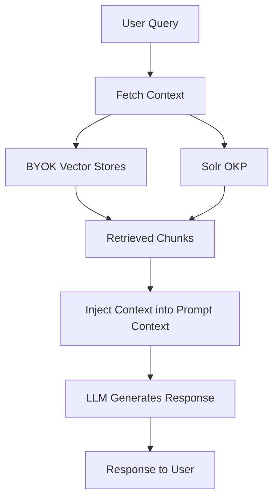
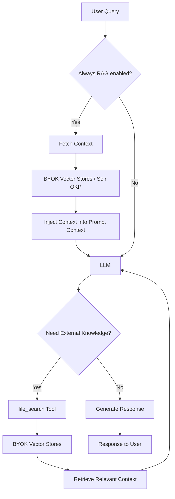

# BYOK (Bring Your Own Knowledge) Feature Documentation

## Overview

The BYOK (Bring Your Own Knowledge) feature in Lightspeed Core enables users to integrate their own knowledge sources into the AI system through Retrieval-Augmented Generation (RAG) functionality. This feature allows the AI to access and utilize custom knowledge bases to provide more accurate, contextual, and domain-specific responses.

---

## Table of Contents

* [What is BYOK?](#what-is-byok)
* [How BYOK Works](#how-byok-works)
* [Prerequisites](#prerequisites)
* [Configuration Guide](#configuration-guide)
  * [Step 1: Prepare Your Knowledge Sources](#step-1-prepare-your-knowledge-sources)
  * [Step 2: Create Vector Database](#step-2-create-vector-database)
  * [Step 3: Configure Embedding Model](#step-3-configure-embedding-model)
  * [Step 4: Configure Llama Stack](#step-4-configure-llama-stack)
  * [Step 5: Configure RAG Strategy](#step-5-configure-rag-strategy)
* [Supported Vector Database Types](#supported-vector-database-types)
* [Configuration Examples](#configuration-examples)
* [Conclusion](#conclusion)

---

## What is BYOK?

BYOK (Bring Your Own Knowledge) is Lightspeed Core's implementation of Retrieval-Augmented Generation (RAG) that allows you to:

- **Integrate custom knowledge sources**: Add your organization's documentation, manuals, FAQs, or any text-based knowledge
- **Enhance AI responses**: Provide contextual, accurate answers based on your specific domain knowledge
- **Maintain data control**: Keep your knowledge sources within your infrastructure
- **Improve relevance**: Get responses that are tailored to your organization's context and terminology

## How BYOK Works

BYOK knowledge sources can be queried in two complementary modes, configured independently:

### Always RAG (pre-query injection)

Context is fetched from your BYOK vector stores and/or Solr **before** the LLM generates a response, and injected into every query automatically. No tool calls are required.



### Tool RAG (on-demand retrieval)

The LLM can call the `file_search` tool during generation when it decides external knowledge is needed. Only BYOK vector stores are supported in Tool RAG mode.



Both modes rely on:
- **Vector Database**: Your indexed knowledge sources stored as vector embeddings
- **Embedding Model**: Converts queries and documents into vector representations for similarity matching

Always RAG additionally supports:
- **Score Multiplier**: Optional weight applied per BYOK vector store when mixing multiple sources. Allows custom prioritization of content. 

---

## Prerequisites

Before implementing BYOK, ensure you have:

### Required Tools
- **rag-content tool**: For creating compatible vector databases
  - Repository: https://github.com/lightspeed-core/rag-content
  - Used for indexing your knowledge sources

### System Requirements
- **Embedding Model**: Local or downloadable embedding model
- **LLM Provider**: OpenAI, vLLM, or other supported inference provider

### Knowledge Sources
- **Directly supported**: Markdown (.md) and plain text (.txt) files
- **Requires conversion**: PDFs, AsciiDoc, HTML, and other formats must be converted to markdown or TXT
- Documentation, manuals, FAQs, knowledge bases (after format conversion)

---

## Configuration Guide

### Step 1: Prepare Your Knowledge Sources

1. **Collect your documents**: Gather all knowledge sources you want to include
2. **Convert formats**: Convert non-supported formats to markdown (.md) or plain text (.txt)
   - **PDF conversion**: Use tools like [docling](https://github.com/DS4SD/docling) to convert PDFs to markdown
   - **Adoc conversion**: Use [custom scripts](https://github.com/openshift/lightspeed-rag-content/blob/main/scripts/asciidoctor-text/convert-it-all.py) to convert AsciiDoc to plain text
3. **Organize content**: Structure your converted documents for optimal indexing
4. **Format validation**: Ensure all documents are in supported formats (.md or .txt)

### Step 2: Create Vector Database

Use the `rag-content` tool to create a compatible vector database:
Please refer https://github.com/lightspeed-core/rag-content to create your vector database

**Metadata Configuration:**
When using the `rag-content` tool, you need to create a `custom_processor.py` script to handle document metadata:

1. **Document URL References**: Implement the `url_function` in your `custom_processor.py` to add URL metadata to each document chunk
2. **Title Extraction**: The system automatically extracts the document title from the first line of each file
3. **Custom Metadata**: You can add additional metadata fields as needed for your use case

Example `custom_processor.py` structure:
```python
class CustomMetadataProcessor(MetadataProcessor):

    def __init__(self, url):
        self.url = url

    def url_function(self, file_path: str) -> str:
        # Return a URL for the file, so it can be referenced when used
        # in an answer
        return self.url
```

**Important Notes:**
- The vector database must be compatible with Llama Stack
- Supported formats: 
  - Llama-Stack Faiss Vector-IO
  - Llama-Stack SQLite-vec Vector-IO
- The same embedding model must be used for both creation and querying

### Step 3: Configure Embedding Model

You have two options for configuring your embedding model:

#### Option 1: Use rag-content Download Script (Optional)
You can use the embedding generation step mentioned in the rag-content repo:

```bash
mkdir ./embeddings_model
pdm run python ./scripts/download_embeddings_model.py -l ./embeddings_model/ -r sentence-transformers/all-mpnet-base-v2 
```

#### Option 2: Manual Download and Configuration
Alternatively, you can download your own embedding model and update the path in your YAML configuration:

1. **Download your preferred embedding model** from Hugging Face or other sources
2. **Place the model** in your desired directory (e.g., `/path/to/your/embedding_models/`)
3. **Update the YAML configuration** to point to your model path:

```yaml
models:
  - model_id: sentence-transformers/all-mpnet-base-v2
    metadata:
        embedding_dimension: 768
    model_type: embedding
    provider_id: sentence-transformers
    provider_model_id: /path/to/your/embedding_models/all-mpnet-base-v2
```

**Note**: Ensure the same embedding model is used for both vector database creation and querying.

### Step 4: Configure Llama Stack

Edit your `run.yaml` file to include BYOK configuration:

```yaml
version: 2
image_name: byok-configuration

# Required APIs for BYOK
apis:
- agents
- inference
- vector_io
- tool_runtime
- safety

providers:
  inference:
  - provider_id: sentence-transformers
    provider_type: inline::sentence-transformers
    config: {}
  - provider_id: openai
    provider_type: remote::openai
    config:
      api_key: ${env.OPENAI_API_KEY}

  agents:
  - provider_id: meta-reference
    provider_type: inline::meta-reference
    config:
      persistence:
        agent_state:
          namespace: agents_state
          backend: kv_default
        responses:
          table_name: agents_responses
          backend: sql_default

  safety:
  - provider_id: llama-guard
    provider_type: inline::llama-guard
    config:
      excluded_categories: []

  vector_io:
  - provider_id: your-knowledge-base
    provider_type: inline::faiss
    config:
      persistence:
        namespace: vector_io::faiss
        backend: byok_backend  # References storage.backends

  tool_runtime:
  - provider_id: rag-runtime
    provider_type: inline::rag-runtime
    config: {}

storage:
  backends:
    kv_default:
      type: kv_sqlite
      db_path: ~/.llama/storage/kv_store.db
    sql_default:
      type: sql_sqlite
      db_path: ~/.llama/storage/sql_store.db
    byok_backend:
      type: kv_sqlite
      db_path: /path/to/vector_db/faiss_store.db

registered_resources:
  models:
  - model_id: your-llm-model
    provider_id: openai
    model_type: llm
    provider_model_id: gpt-4o-mini
  - model_id: sentence-transformers/all-mpnet-base-v2
    model_type: embedding
    provider_id: sentence-transformers
    provider_model_id: /path/to/embedding_models/all-mpnet-base-v2
    metadata:
      embedding_dimension: 768
  vector_stores:
  - vector_store_id: your-index-id  # ID used during index generation
    provider_id: your-knowledge-base
    embedding_model: sentence-transformers/all-mpnet-base-v2
    embedding_dimension: 768
  tool_groups:
  - toolgroup_id: builtin::rag
    provider_id: rag-runtime
```

**⚠️ Important**: The `vector_store_id` value must exactly match the ID you provided when creating the vector database using the rag-content tool. This identifier links your Llama Stack configuration to the specific vector database index you created.

> [!TIP]
> Instead of manually editing `run.yaml`, you can declare your knowledge sources in the `byok_rag`
> section of `lightspeed-stack.yaml`. The service automatically generates the required configuration
> at startup.
>
> ```yaml
> byok_rag:
>   - rag_id: my-docs           # Unique identifier for this knowledge source
>     rag_type: inline::faiss
>     embedding_model: sentence-transformers/all-mpnet-base-v2
>     embedding_dimension: 768
>     vector_db_id: your-index-id  # Llama Stack vector store ID (from index generation)
>     db_path: /path/to/vector_db/faiss_store.db
>     score_multiplier: 1.0       # Optional: weight results when mixing multiple sources
> ```
>
> When multiple BYOK sources are configured, `score_multiplier` adjusts the relative importance of
> each store's results during Always RAG retrieval. Values above 1.0 boost a store; below 1.0 reduce it.

### Step 5: Configure RAG Strategy

Add a `rag` section to your `lightspeed-stack.yaml` to choose how BYOK knowledge is used:

```yaml
rag:
  # Always RAG: inject context before every LLM response (no tool calls needed)
  always:
    byok:
      enabled: true   # fetch and inject BYOK vector store context pre-query
    solr:
      enabled: true   # fetch and inject Solr OKP context pre-query

  # Tool RAG: the LLM can call file_search to retrieve context on demand
  tool:
    byok:
      enabled: true   # expose BYOK vector stores as the file_search tool
```

Both modes can be enabled simultaneously. Choose based on your latency and control preferences:

| Mode | When context is fetched | Tool call needed | Supported sources | score_multiplier |
|------|------------------------|------------------|-------------------|-----------------|
| Always RAG | Before every query | No | BYOK + Solr | Yes (BYOK only) |
| Tool RAG | On LLM demand | Yes | BYOK only | No |

---

## Supported Vector Database Types

### 1. FAISS (Recommended)
- **Type**: Local vector database with SQLite metadata
- **Best for**: Small to medium-sized knowledge bases
- **Configuration**: `inline::faiss`
- **Storage**: SQLite database file

```yaml
providers:
  vector_io:
  - provider_id: faiss-knowledge
    provider_type: inline::faiss
    config:
      persistence:
        namespace: vector_io::faiss
        backend: faiss_backend

storage:
  backends:
    faiss_backend:
      type: kv_sqlite
      db_path: /path/to/faiss_store.db
```

### 2. pgvector (PostgreSQL)
- **Type**: PostgreSQL with pgvector extension
- **Best for**: Large-scale deployments, shared knowledge bases
- **Configuration**: `remote::pgvector`
- **Requirements**: PostgreSQL with pgvector extension

```yaml
vector_io:
- provider_id: pgvector-knowledge
  provider_type: remote::pgvector
  config:
    host: localhost
    port: 5432
    db: knowledge_db
    user: lightspeed_user
    password: ${env.DB_PASSWORD}
    kvstore:
      type: sqlite
      db_path: .llama/distributions/pgvector/registry.db
```

**pgvector Table Schema:**
- `id` (text): UUID identifier of the chunk
- `document` (jsonb): JSON containing content and metadata
- `embedding` (vector(n)): The embedding vector (n = embedding dimension)

---

## Configuration Examples

### Example 1: OpenAI + FAISS
Complete configuration for OpenAI LLM with local FAISS knowledge base:

```yaml
version: 2
image_name: openai-faiss-byok

apis:
- agents
- inference
- vector_io
- tool_runtime
- safety

providers:
  inference:
  - provider_id: sentence-transformers
    provider_type: inline::sentence-transformers
    config: {}
  - provider_id: openai
    provider_type: remote::openai
    config:
      api_key: ${env.OPENAI_API_KEY}

  agents:
  - provider_id: meta-reference
    provider_type: inline::meta-reference
    config:
      persistence:
        agent_state:
          namespace: agents_state
          backend: kv_default
        responses:
          table_name: agents_responses
          backend: sql_default

  safety:
  - provider_id: llama-guard
    provider_type: inline::llama-guard
    config:
      excluded_categories: []

  vector_io:
  - provider_id: company-docs
    provider_type: inline::faiss
    config:
      persistence:
        namespace: vector_io::faiss
        backend: company_docs_backend

  tool_runtime:
  - provider_id: rag-runtime
    provider_type: inline::rag-runtime
    config: {}

storage:
  backends:
    kv_default:
      type: kv_sqlite
      db_path: ~/.llama/storage/kv_store.db
    sql_default:
      type: sql_sqlite
      db_path: ~/.llama/storage/sql_store.db
    company_docs_backend:
      type: kv_sqlite
      db_path: /home/user/vector_dbs/company_docs/faiss_store.db

registered_resources:
  models:
  - model_id: gpt-4o-mini
    provider_id: openai
    model_type: llm
    provider_model_id: gpt-4o-mini
  - model_id: sentence-transformers/all-mpnet-base-v2
    model_type: embedding
    provider_id: sentence-transformers
    provider_model_id: /home/user/embedding_models/all-mpnet-base-v2
    metadata:
      embedding_dimension: 768
  vector_stores:
  - vector_store_id: company-knowledge-index
    provider_id: company-docs
    embedding_model: sentence-transformers/all-mpnet-base-v2
    embedding_dimension: 768
  tool_groups:
  - toolgroup_id: builtin::rag
    provider_id: rag-runtime
```

### Example 2: vLLM + pgvector
Configuration for local vLLM inference with PostgreSQL knowledge base:

```yaml
version: 2
image_name: vllm-pgvector-byok

apis:
- agents
- inference
- vector_io
- tool_runtime
- safety

models:
- model_id: meta-llama/Llama-3.1-8B-Instruct
  provider_id: vllm
  model_type: llm
  provider_model_id: null

- model_id: sentence-transformers/all-mpnet-base-v2
  metadata:
      embedding_dimension: 768
  model_type: embedding
  provider_id: sentence-transformers
  provider_model_id: sentence-transformers/all-mpnet-base-v2

providers:
  inference:
  - provider_id: sentence-transformers
    provider_type: inline::sentence-transformers
    config: {}
  - provider_id: vllm
    provider_type: remote::vllm
    config:
      url: http://localhost:8000/v1/
      api_token: your-token-here

  agents:
  - provider_id: meta-reference
    provider_type: inline::meta-reference
    config:
      persistence:
        agent_state:
          namespace: agents_state
          backend: kv_default
        responses:
          table_name: agents_responses
          backend: sql_default

  safety:
  - provider_id: llama-guard
    provider_type: inline::llama-guard
    config:
      excluded_categories: []

  vector_io:
  - provider_id: enterprise-knowledge
    provider_type: remote::pgvector
    config:
      host: postgres.company.com
      port: 5432
      db: enterprise_kb
      user: rag_user
      password: ${env.POSTGRES_PASSWORD}
      kvstore:
        type: sqlite
        db_path: .llama/distributions/pgvector/registry.db

  tool_runtime:
  - provider_id: rag-runtime
    provider_type: inline::rag-runtime
    config: {}

tool_groups:
- provider_id: rag-runtime
  toolgroup_id: builtin::rag
  args: null
  mcp_endpoint: null

vector_stores:
- embedding_dimension: 768
  embedding_model: sentence-transformers/all-mpnet-base-v2
  provider_id: enterprise-knowledge
  vector_store_id: enterprise-docs
```

---

## Conclusion

The BYOK (Bring Your Own Knowledge) feature in Lightspeed Core provides powerful capabilities for integrating custom knowledge sources through RAG technology. By following this guide, you can successfully implement and configure BYOK to enhance your AI system with domain-specific knowledge.

For additional support and advanced configurations, refer to:
- [RAG Configuration Guide](rag_guide.md)
- [Llama Stack Documentation](https://llama-stack.readthedocs.io/)
- [rag-content Tool Repository](https://github.com/lightspeed-core/rag-content)

Remember to regularly update your knowledge sources and monitor system performance to maintain optimal BYOK functionality.