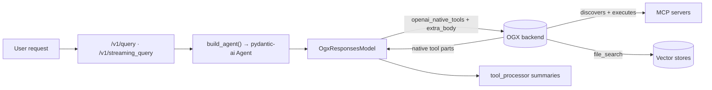
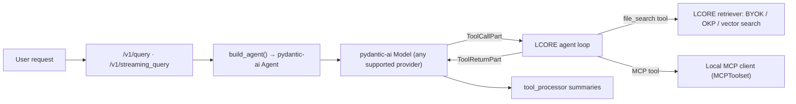
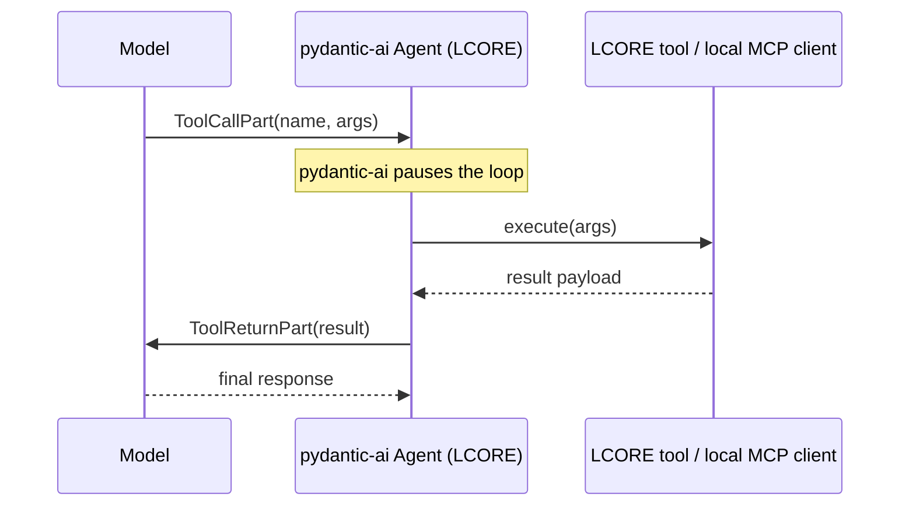
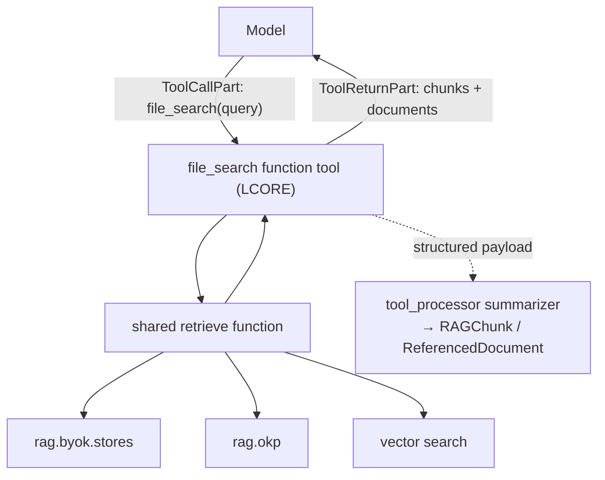
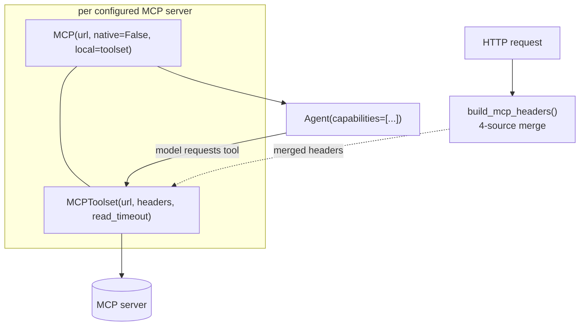
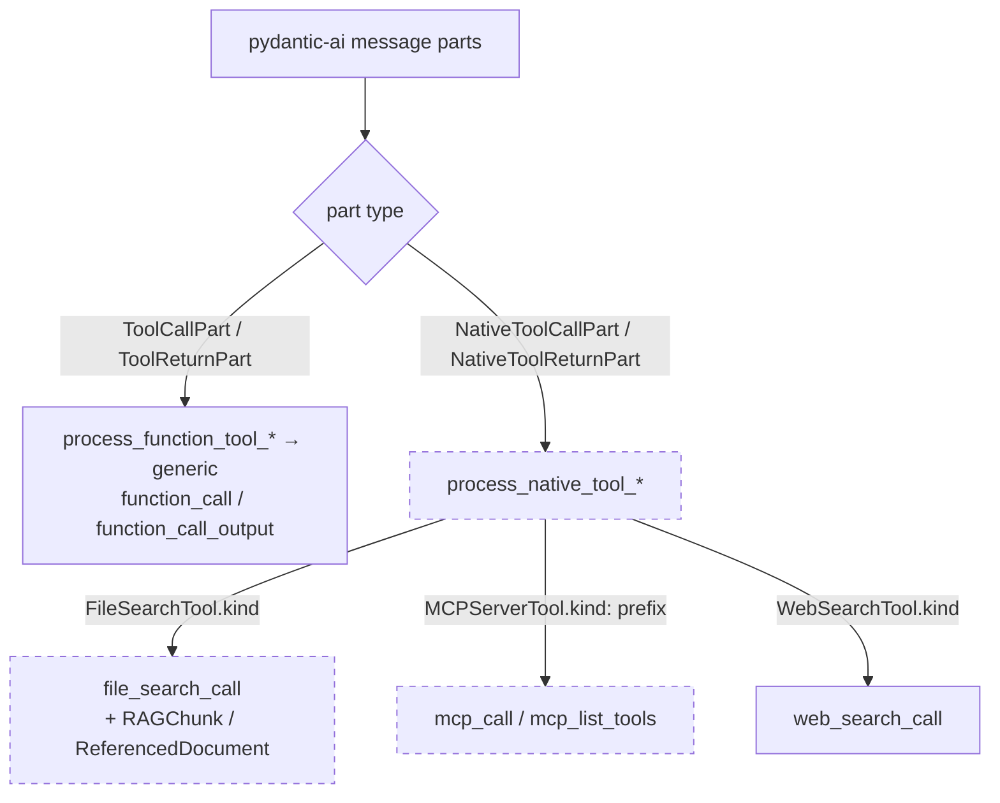

# Tools migration to pydantic-ai

## Metadata

- **Author:** Andrej Šimurka, Anik Bhattacharjee
- **Created:** 2026-09-24
- **Tracking:** [UIESTRAT-216: Inference backend migration](https://redhat.atlassian.net/browse/UIESTRAT-216)

## Objective

Once LCORE owns the agent loop (post-OGX), run MCP, file search / RAG, and skills
as **agent-executed function tools** so that tool behavior is identical across
every inference provider LCORE supports.

## Background

Today LCORE's agent endpoints (`/v1/query`, `/v1/streaming_query`, `/a2a`) already
run through a pydantic-ai `Agent`, but the agent's model is `OgxResponsesModel`,
which forwards every request to the OGX backend. Tools ride along inside that
request: `get_mcp_tools` (`src/utils/responses.py:743`) builds OGX-typed
`InputToolMCP` objects that are passed to OGX via `openai_native_tools` /
`extra_body`, and **OGX performs MCP discovery and execution** server-side.
File search works the same way — OGX runs it as a provider-native tool and streams
back native tool parts that `tool_processor.py` reshapes into LCORE turn summaries.



When OGX is removed, that middle hop disappears and LCORE has to do the work OGX
was doing: connect to MCP servers from the agent process, run retrieval over
LCORE's own corpora, and feed results back into the model — for **every** provider,
not just the ones with a hosted tool API.

LCORE's officially supported inference providers are **OpenAI, Azure, VertexAI,
WatsonX, AWS Bedrock, RHOAI (vLLM), and RHEL AI (RHAIIS/vLLM)**. Tools must behave
the same across all of them. MCP is **local only** — the agent process is the MCP
client; provider-hosted MCP is out of scope.



## Goals

- Tools behave **identically across all supported providers** (OpenAI, Azure,
  VertexAI, WatsonX, Bedrock, RHOAI/RHEL AI vLLM) after OGX removal.
- One LCORE-owned retrieval path for file search over BYOK / OKP corpora — filters,
  `max_chunks`, auth, timeouts, and telemetry stay in LCORE.
- MCP runs as a **local, in-agent-process client** with the **same per-request
  credential merge** LCORE already performs today.
- Preserve the typed API surface: `/v2/conversations` and SSE consumers keep
  receiving `file_search_call`, `mcp_call`, `mcp_list_tools` events and populated
  `rag_chunks` / `referenced_documents`.
- Keep per-request isolation: a fresh agent (and fresh MCP clients) per request,
  never a process-global client carrying one user's token.

## Non-goals

- **Provider-hosted / native MCP** (`native=True`). Out of scope for this
  iteration — the baseline is a local MCP client. The capability-based wiring
  (see Architecture → MCP) keeps a future `native=True` upgrade open without a
  config-schema change.
- **Inline RAG** (injecting context *before* the model call). Related, but a
  separate feature; this doc covers the *tool* form of retrieval.
- **Shared/cached MCP clients** across users or requests.
- **Web search.** `WebSearchTool` is unrelated unless we separately decide to move
  it client-side.

## Scenarios

Post-OGX, file search and MCP are ordinary function tools. From
the model's point of view a tool call is a tool call; LCORE runs it and returns the
result. The loop is the same for every provider.



**A. Model requests retrieval.** The model emits a `file_search` tool call; the
LCORE agent runs the shared retriever over the configured BYOK/OKP corpora and
returns chunks + document references as a structured `ToolReturnPart`.

**B. Model requests an MCP tool.** The model emits a call for a tool advertised by
a configured MCP server; the local MCP client (an `MCPToolset` built for this
request with merged headers) invokes the remote server and returns the result.

## Architecture

### Baseline: everything is a function tool

pydantic-ai can wire some features as provider-*native* tools, but LCORE's baseline
is the **function-tool path**: the model emits a tool call, pydantic-ai pauses the
loop, LCORE (or the in-process MCP client) runs it, and the result feeds into the
next model request. That loop is provider-agnostic, so one LCORE-owned path keeps
behavior, auth, corpora, timeouts, and telemetry identical across the supported set.

Concretely, this changes how `build_agent` (in `src/utils/pydantic_ai_helpers.py`)
constructs the agent. Today it passes **only** `capabilities=`:

```python
# today
return Agent(
    model,
    instructions=responses_params.instructions,
    capabilities=capabilities,          # shields + skills
    defer_model_check=True,
)
```

Post-OGX, the agent also carries the LCORE retrieval tool and per-server MCP
capabilities:

```python
# target
return Agent(
    model,                              # any supported provider
    instructions=responses_params.instructions,
    tools=[Tool(file_search, name="file_search")],
    capabilities=[*capabilities, *mcp_capabilities],
    defer_model_check=True,
)
```

### File search / RAG: one LCORE tool over a shared retriever

"file_search" means the model may call a retrieval tool during generation. LCORE
already has retrieval (BYOK, OKP, vector-search utilities). The migration question
is whether that retrieval stays *our* tool over LCORE corpora, or whether we lean
on a provider's hosted file-search API where one exists.

Native file search is available on almost none of the supported set:

| Supported provider | Native `FileSearchTool`? | Notes |
|---|---|---|
| OpenAI (Responses API) | ✅ | OpenAI vector stores (Files API). Not Chat Completions. |
| Azure OpenAI | ⚠️ limited | Only if the deployment exposes the same Responses + vector-store surface; not assumed for every Azure setup. |
| Google VertexAI | ❌ | pydantic-ai marks Vertex-style unsupported for `FileSearchTool`. |
| IBM WatsonX | ❌ | Not supported. |
| AWS Bedrock | ❌ | Not supported. |
| RHOAI / RHEL AI (vLLM) | ❌ | OpenAI-compatible Chat Completions; no native file search. |

Even where native file search exists, the corpus lives in the **provider's** vector
store, not LCORE BYOK/OKP. So the design is one LCORE retriever exposed as a
function tool:



The tool reads its corpora and limits from existing config —
`configuration.rag.retrieval.tool.sources` and `.max_chunks` (see
`src/models/config.py`, `RetrievalStrategyConfiguration`) — so nothing about the
operator-facing RAG config needs to change:

```python
from pydantic_ai import Agent, RunContext
from pydantic_ai.tools import Tool
from configuration import configuration

async def file_search(ctx: RunContext[None], query: str) -> dict:
    tool_cfg = configuration.rag.retrieval.tool
    sources = list(tool_cfg.sources or [])
    max_chunks = tool_cfg.max_chunks
    # reuse the same core retrieve used by inline RAG
    return {"chunks": [...], "documents": [...]}

agent = Agent(model, tools=[Tool(file_search, name="file_search")], capabilities=[*existing])
```

Inline RAG (inject context before the model call) stays a separate feature; sharing
one core `retrieve` function between the inline adapter and this tool is fine — both
stay LCORE-owned.

### MCP: local client, per-request auth

After OGX removal, LCORE connects to MCP servers **from the agent process**,
advertises their tools to the model, and executes calls when the model requests
them — with the same per-request credentials it already merges today.

pydantic-ai offers two local entry points; we use **both together**: one **MCP
capability** per configured server with `native=False`, wrapping a fully configured
**`MCPToolset`** passed as `local=`. The capability is the agent-facing unit
(attaches via `capabilities=` alongside shields/skills, and leaves room for a
future `native=True` without changing the config schema); the toolset carries the
client knobs LCORE needs today (timeouts, headers, per-user auth).



```python
from pydantic_ai import Agent
from pydantic_ai.capabilities import MCP
from pydantic_ai.mcp import MCPToolset
from utils.mcp.mcp_headers import build_mcp_headers

# Per HTTP request — same merge as today's get_mcp_tools
merged = build_mcp_headers(config, mcp_headers, request.headers, token)

mcp_capabilities = []
for server in configuration.mcp_servers:
    toolset = MCPToolset(
        server.url,
        id=f"mcp:{server.name}",
        headers=merged.get(server.name, {}) or None,
        include_instructions=True,
        read_timeout=float(server.timeout) if server.timeout else None,
    )
    mcp_capabilities.append(MCP(server.url, native=False, local=toolset, id=f"mcp:{server.name}"))

agent = Agent(model, capabilities=[*existing_capabilities, *mcp_capabilities])
```

Two details matter:

- **Use `headers=` on the toolset for the full LCORE merge.** A lone bearer token
  would drop custom and propagated headers. `build_mcp_headers`
  (in `src/utils/mcp/mcp_headers.py`) already merges four sources in priority
  order: client-supplied `MCP-HEADERS`, statically resolved config auth,
  Kubernetes bearer tokens, and **allowlist-driven** propagated request headers
  (e.g. `x-rh-identity` when the server's allowlist permits it).
- **No shared client across users.** LCORE already builds a new agent per request;
  keep doing the same for MCP — construct fresh `MCP` + `MCPToolset` pairs with
  that request's merged headers, exactly as today's `get_mcp_tools` builds fresh
  `InputToolMCP` objects. pydantic-ai session identity is per client instance, and
  LCORE already isolates per request.

**Existing building block:** LCORE already has a non-OGX, client-side MCP path —
`list_mcp_tools` in `src/utils/mcp/mcp_tools.py` (docstring: "without OGX"), used by
the `/tools` endpoint. Discovery over MCP without OGX is therefore already proven in
the codebase; this design extends that from listing to execution inside the agent
loop.

### Skills and other function tools

Agent skills and custom functions are already modeled as tools LCORE executes.
Removing OGX doesn't change that contract — they remain pydantic-ai function tools
or capabilities attached to the per-request agent via `_agent_capabilities`
(`src/utils/pydantic_ai_helpers.py:191`). Lifecycle matches MCP: wired when
`build_agent` runs for that request, not as a long-lived shared toolset.

### Parsing agent responses (`tool_processor`)

This is the subtle part. `src/utils/agents/tool_processor.py` reduces pydantic-ai
message parts into LCORE turn summaries through **two pipelines**:



Under OGX, file search and MCP arrive on the **native** path:
`summarize_native_tool_call` / `process_native_tool_result` match on
`FileSearchTool.kind` and on names prefixed with `_MCP_SERVER_TOOL_PREFIX`
(`f"{MCPServerTool.kind}:"`), then call specialized helpers
(`summarize_file_search_result`, `summarize_mcp_call_result`,
`summarize_mcp_list_tools_result`) that understand the provider's return shape and
populate `rag_chunks` / `referenced_documents`.

With the preferred baseline, file search and MCP are **no longer native** — they
show up as ordinary `ToolCallPart` / `ToolReturnPart`. **The native match arms
(dashed above) simply never fire for these product features.** If we only flip
registration and leave `tool_processor` unchanged, MCP and file search collapse into
generic `function_call` / `function_call_output`: SSE and conversation summaries
lose the typed `mcp_*` / `file_search_call` events, and `rag_chunks` /
`referenced_documents` stop being populated.

So the projection layer must move with the registration:

| Feature | Today (native) | After switch (function tools) |
|---|---|---|
| **file_search** | `NativeTool*` + `FileSearchTool.kind` → `file_search_call`; parse OpenAI-shaped results into `RAGChunk` / `ReferencedDocument` | `ToolCallPart` / `ToolReturnPart` for the LCORE tool name. Return payload must be a **known structured shape** so a function-tool summarizer can rebuild the same RAG fields — not `part.model_response_str()` alone. |
| **MCP** | Native name `mcp:…` + action/args → `mcp_call` / `mcp_list_tools` | Local MCP client exposes each remote tool as a normal function tool (name = MCP tool name). Need naming/metadata conventions (server label, list vs. call) if API clients still expect `type="mcp_call"` / `mcp_list_tools`. |

Practical steps:

- Extend `summarize_function_tool_call` / `summarize_function_tool_result` (or add
  LCORE-specific helpers) to recognize the `file_search` tool and MCP tools by name
  / return schema, and emit the same `ToolCallSummary` / `ToolResultSummary` types
  the UI and `/v2/conversations` already consume.
- Move RAG document/chunk extraction off the OpenAI-native content shapes onto
  whatever the LCORE retriever returns — reusing `build_referenced_document` and
  `rag_chunks_from_file_search_results` ideas with LCORE's own hit shape.
- The native handlers for `FileSearchTool` / `MCPServerTool` become unused for the
  product path — safe to keep briefly for leftover history, then delete once nothing
  emits those parts.
- Message history for the next turn will store `ToolCallPart` / `ToolReturnPart`
  (not `NativeTool*`) — correct for continuation; the API projection layer is what
  must learn the new shapes.

## Preferred stack (summary)

| Concern | Preferred | Avoid as default | Why |
|---|---|---|---|
| **file_search** | LCORE function tool over the shared retriever | Native `FileSearchTool` as the only path | Native only on OpenAI Responses (maybe some Azure); missing on VertexAI / WatsonX / Bedrock / vLLM; BYOK stays LCORE-owned |
| **MCP** | `MCP(native=False, local=MCPToolset(...))` per server + per-request headers | Provider-hosted / `native=True`; shared client for user tokens | Capability for agent attachment / future native option; toolset for client knobs; same path on all providers |
| **Skills** | Existing function tools / capabilities on the per-request agent | — | Already client-side application logic |
| **Auth** | Per-request agent + fresh MCP/MCPToolset (as with today's `InputToolMCP`) | Process-global / cached MCP client for user tokens | pydantic-ai session identity is per client instance; LCORE already isolates per request |

## Alternatives considered

### file_search: LCORE tool vs. native vs. mix

| Option | What it is | Pros | Cons |
|---|---|---|---|
| **A. LCORE custom tool (chosen)** | An `@agent.tool` calling LCORE vector search / BYOK / OKP | Same on all providers; reuses existing retrieval; filters/`max_chunks`/auth stay in LCORE | We own latency, failures, and result formatting |
| **B. Native `FileSearchTool`** | Provider hosts the search over its own vector store | Less retrieval code on OpenAI Responses (and some Azure) | Missing on VertexAI / WatsonX / Bedrock / vLLM; corpus isn't LCORE BYOK; conflicts with dropping the OGX vector-store proxy |
| **C. Mix A + B** | Dual implementation | Possible latency win on OpenAI | Two RAG contracts; harder parity tests |

**Chosen: A.** LCORE must serve every supported provider with the same BYOK/OKP
corpora; one retriever is the only consistent design.

### MCP: capability alone vs. toolset alone vs. both

| Option | Pros | Cons |
|---|---|---|
| **MCP capability alone** | Primary pydantic-ai entry point; attaches via `capabilities=`; room for a later `native=True` without a config-schema change | Thin client API without `local=`; must keep `native=False` on supported providers today |
| **`MCPToolset` via `toolsets=` alone** | Full client knobs (timeouts, headers, `http_client`, `process_tool_call`); local-only by construction | Parallel attachment path; no capability-level native upgrade path |
| **Both (chosen)** | Capability is the agent-facing unit; toolset carries the client knobs LCORE needs | Slightly more wiring per server |

**Chosen: both.** One MCP capability per server with `native=False` and a fully
configured `MCPToolset` as `local=`.

## Open issues

- **MCP event shape compatibility.** If API clients still expect `type="mcp_call"`
  and `mcp_list_tools`, we need naming/metadata conventions on the function-tool
  path (server label, list vs. call) so the projection layer can reproduce them.
- **file_search return schema.** Define the structured payload the LCORE
  `file_search` tool returns so the summarizer can rebuild `rag_chunks` /
  `referenced_documents` deterministically.
- **When to delete the native match arms** for `FileSearchTool` / `MCPServerTool` —
  after nothing emits those parts, versus keeping them for historical replay.
- **Web search** — decide whether `WebSearchTool` also moves client-side or stays
  out of scope.

## Implementation timeline

- **Milestone 1 — file_search as a LCORE function tool.** Register the tool over
  the shared retriever; wire `tools=` into `build_agent`.
- **Milestone 2 — teach `tool_processor` the function-tool shapes.** Emit
  `file_search_call` + `rag_chunks` / `referenced_documents` from the function-tool
  path; add naming conventions.
- **Milestone 3 — local MCP client.** One `MCP(native=False, local=MCPToolset(...))`
  per configured server, per-request header merge via `build_mcp_headers`; reproduce
  `mcp_call` / `mcp_list_tools` summaries.
- **Milestone 4 — parity + cleanup.** Provider parity tests across the supported
  set; remove the now-dead native match arms once nothing emits those parts.

## Appendix

### Supported-provider tool matrix

| Provider | Native file_search | MCP (local client) | Skills |
|---|---|---|---|
| OpenAI (Responses) | ✅ (unused by default) | ✅ | ✅ |
| Azure OpenAI | ⚠️ limited (unused by default) | ✅ | ✅ |
| VertexAI | ❌ | ✅ | ✅ |
| WatsonX | ❌ | ✅ | ✅ |
| AWS Bedrock | ❌ | ✅ | ✅ |
| RHOAI / RHEL AI (vLLM) | ❌ | ✅ | ✅ |

All providers use the LCORE function-tool path, so the effective behavior column is
identical everywhere.

### Doc links

- pydantic-ai: [Function tools](https://pydantic.dev/docs/ai/tools-toolsets/tools/)
- pydantic-ai: [`FileSearchTool` / native tools](https://pydantic.dev/docs/ai/tools-toolsets/native-tools/)
- pydantic-ai: [MCP overview](https://pydantic.dev/docs/ai/mcp/overview/)
- pydantic-ai: [`MCPToolset` client](https://pydantic.dev/docs/ai/mcp/client/)
- pydantic-ai: [MCP capability / per-user authentication](https://pydantic.dev/docs/ai/capabilities/mcp/)
- pydantic-ai: [Message history / part types](https://pydantic.dev/docs/ai/core-concepts/message-history/)
