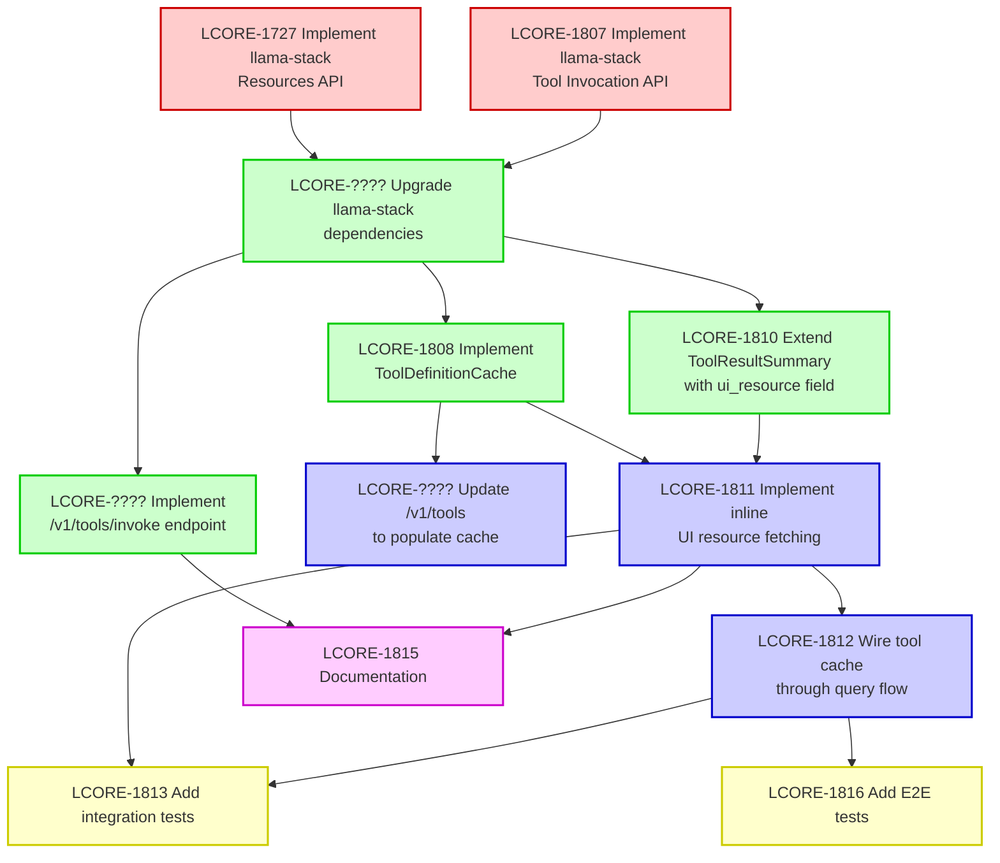

# MCP Apps Implementation Dependency Graph

## Visual Dependency Graph

```mermaid
graph TD
    %% Llama Stack Work (External)
    T1[LCORE-1727 Implement llama-stack<br/>Resources API]
    T2[LCORE-1807 Implement llama-stack<br/>Tool Invocation API]

    %% Core Dependencies
    T3[LCORE-???? Upgrade llama-stack<br/>dependencies]

    %% Foundation Layer - Can start in parallel after upgrade
    T4[LCORE-1808 Implement<br/>ToolDefinitionCache]
    T6[LCORE-1810 Extend ToolResultSummary<br/>with ui_resource field]
    T12[LCORE-???? Implement<br/>/v1/tools/invoke endpoint]

    %% Implementation Layer
    T5[LCORE-???? Update /v1/tools<br/>to populate cache]
    T7[LCORE-1811 Implement inline<br/>UI resource fetching]

    %% Integration Layer
    T8[LCORE-1812 Wire tool cache<br/>through query flow]

    %% Testing Layer
    T10[LCORE-1813 Add integration tests]
    T11[LCORE-1816 Add E2E tests]

    %% Documentation Layer
    T14[LCORE-1815 Documentation]

    %% Dependencies
    T1 --> T3
    T2 --> T3

    T3 --> T4
    T3 --> T6
    T3 --> T12

    T4 --> T5
    T4 --> T7

    T6 --> T7

    T7 --> T8
    T7 --> T10

    T8 --> T10
    T8 --> T11

    T12 --> T14

    T7 --> T14

    %% Styling
    classDef external fill:#ffcccc,stroke:#cc0000,stroke-width:2px
    classDef foundation fill:#ccffcc,stroke:#00cc00,stroke-width:2px
    classDef implementation fill:#ccccff,stroke:#0000cc,stroke-width:2px
    classDef testing fill:#ffffcc,stroke:#cccc00,stroke-width:2px
    classDef docs fill:#ffccff,stroke:#cc00cc,stroke-width:2px

    class T1,T2 external
    class T3,T4,T6,T12 foundation
    class T5,T7,T8 implementation
    class T10,T11 testing
    class T14 docs
```
