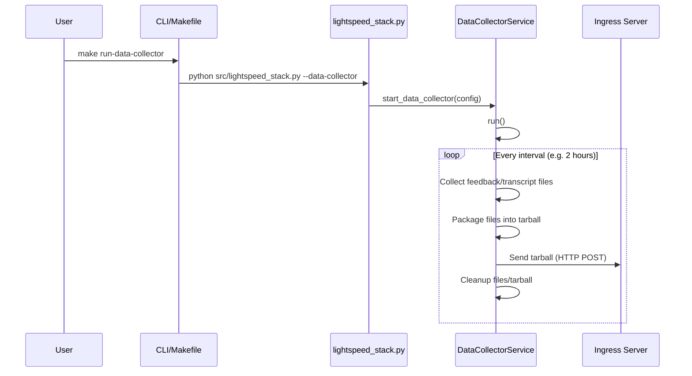
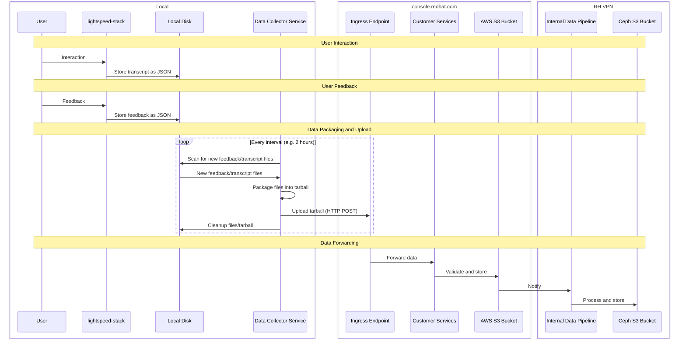

# User Data Collection
This document outlines the process of capturing user interactions, feedback, and system responses in the lightspeed-stack service through its User Data Collection system. Understanding this process will help administrators configure data collection settings, monitor user engagement patterns, and ensure proper data transmission to Red Hat's analytics infrastructure for service improvement and optimization.

## Components

### lightspeed-stack
The core service of Lightspeed Core.
- Every interaction through `/query` or `/streaming_query` creates a JSON transcript file that is saved to a configured location on the local disk.

**Example Transcript JSON**
```json
{
  "metadata": {
    "provider": "openai",
    "model": "gpt-4-turbo",
    "user_id": "user_id_placeholder",
    "conversation_id": "ad14e9de-72d6-42a3-98bf-017e9c0a6b89",
    "timestamp": "2025-08-04T16:55:17.574233+00:00"
  },
  "redacted_query": "Hello",
  "query_is_valid": true,
  "llm_response": "Hi there! How can I assist you today?",
  "rag_chunks": [],
  "truncated": false,
  "attachments": []
}
```
- When a user provides feedback (regarding the effectiveness of `lightspeed-stack`'s answers) the data is **POST**ed to the `/feedback` endpoint which creates a JSON feedback file that is saved to a configured location on the local disk.

**Example Feedback JSON**
```json
{
  "user_id": "user_id_placeholder",
  "timestamp": "2025-08-04 16:59:52.004143+00:00",
  "conversation_id": "ad14e9de-72d6-42a3-98bf-017e9c0a6b89",
  "user_question": "Hello",
  "llm_response": "Hi there! How can I assist you today?",
  "sentiment": 1,
  "user_feedback": "Satisfied with the response quality.",
  "categories": null
}
```

### Data Collector Service
A service contained within `lightspeed-stack` that is ran in addition to `lightspeed-stack`.
- Ran in addition to a running instance of `lightspeed-stack`. The Data Collector Service is ran using a seprate **make target** than when running `lightspeed-stack`.

```bash
make run-data-collector
```

- This service scans for new transcript/feedback files every configured time period.
- When new files are found they are packaged into a tarball and are **POST**ed to the configured ingress server.

### console.redhat.com - Ingress
- Responsible for accepting payload (our tarball) and storing into internal AWS S3 Bucket (unreachable for us) and notifying relevant postprocessing (CCX pipeline)

## Data Collector Service Diagram



## Data Flow Diagram


## Configuration
```yaml
# ... rest of lightspeed-stack.yaml ...
user_data_collection:
  feedback_enabled: true
  feedback_storage: "/tmp/data/feedback"
  transcripts_enabled: true
  transcripts_storage: "/tmp/data/transcripts"
  data_collector:
    enabled: false
    ingress_server_url: "https://example.ingress.com/upload"
    ingress_server_auth_token: xxyyzz
    ingress_content_service_name: null
    collection_interval: 7200
    cleanup_after_send: true
    connection_timeout_seconds: 30
```

### Configuration Options

#### User Data Collection Settings

- **`feedback_enabled`** (boolean)
  - Enables or disables the collection of user feedback data
  - When `true`, feedback submitted via the `/feedback` endpoint will be stored as JSON files
  - When `false`, no feedback data will be collected or stored

- **`feedback_storage`** (string)
  - Specifies the local directory path where feedback JSON files will be stored
  - Directory will be created automatically if it doesn't exist
  - Each feedback submission creates a separate JSON file with timestamp and conversation ID

- **`transcripts_enabled`** (boolean)
  - Enables or disables the collection of conversation transcript data
  - When `true`, all interactions through `/query` or `/streaming_query` will be stored as JSON files
  - When `false`, no transcript data will be collected or stored

- **`transcripts_storage`** (string)
  - Specifies the local directory path where transcript JSON files will be stored
  - Directory will be created automatically if it doesn't exist
  - Each query/response creates a separate JSON file with conversation metadata

#### Data Collector Service Settings

- **`enabled`** (boolean)
  - Enables or disables the data collector service
  - When `true`, the service will run alongside lightspeed-stack and periodically upload collected data
  - When `false`, data will only be stored locally without any upload functionality

- **`ingress_server_url`** (string, required when enabled)
  - The URL endpoint where collected data will be uploaded via HTTP POST
  - Should include the full URL including protocol (http/https)
  - Example: `"https://console.redhat.com/api/ingress/v1/upload"`

- **`ingress_server_auth_token`** (string, optional)
  - Authentication token used for authenticating with the ingress server
  - Token will be included in the Authorization header of upload requests
  - Should be kept secure and rotated regularly

- **`ingress_content_service_name`** (string, required when enabled)
  - Service name identifier sent with the data upload
  - Used by the ingress server to identify the source of the data
  - Can be `null` if not required by the ingress service

- **`collection_interval`** (integer)
  - Time interval in seconds between data collection and upload cycles
  - Minimum recommended value is 300 seconds (5 minutes)

- **`cleanup_after_send`** (boolean)
  - Determines whether local files are deleted after successful upload
  - When `true`, transcript and feedback files are removed after successful transmission
  - When `false`, files are retained locally (may require manual cleanup)

- **`connection_timeout_seconds`** (integer)
  - HTTP request timeout in seconds for upload operations
  - Applies to both connection establishment and data transfer
  - Increase for slower network connections or large data uploads

## How to Test